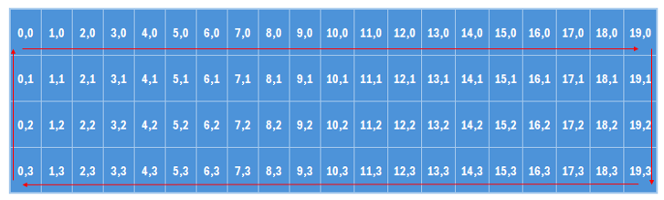

# Opdracht: Rondje over het scherm.

Het is nu tijd voor een opdracht. Maak een eigen tekentje en laat deze een rondje langs de rand van het scherm lopen. 



Eisen:
- Het tekentje maakt een vloeiende beweging (blijft niet in de hoeken 'hangen'). 
- Het tekentje heeft een duidelijk voorkant en veranderd dus van richting (denk aan PacMan). 
- Gebruik een [_for_-loop](https://docs.arduino.cc/language-reference/en/structure/control-structure/for/). 


## Hoe beweegt een tekentje over het scherm?

Het tekentje wekt de indruk van beweging wanneer je het achtereenvolgens hokje na hokje laat verschijnen. In de loop heb je hiervoor vier regels nodig die zich herhalen.

```c
  // Dit stelt de positie in op het scherm waar het tekentje geplaatst wordt.
  lcd.setCursor(0,0);  

  // Dit schrijft het tekentje naar die positie.
  lcd.write(1); 

  // Een korte delay - de tijd die het op het scherm blijft.
  delay(200); 

  // Het scherm wordt gewist. 
  lcd.clear(); 
```

Wanneer deze vier regels herhaalt worden met elke keer een volgende positie - `0,0`, `1,0`, `2,0`, `3,0`, `4,0` etc. - 'beweegt' het tekentje dus van links naar rechts. 
Het zou echter erg omslachtig zijn wanneer deze regels allemaal uitgeschreven zouden worden. Daarom gebruiken we een _for_-loop.


## Hoe werkt een _for_-loop ook alweer?

De _for_-loop wordt gebruikt om een stukje code meerdere malen uit te voeren. De syntax is als volgt:
```c
  for (initiatie; voorwaarde; stapgrootte) {
      // Deze code wordt herhaald zoalng er aan de voorwaarde voldaan wordt
  }
```

Parameters: 
- initiatie: bijvoorbeeld `int i = 0`. Dit zegt dat er een variabele `i` is met datatype `integer` (heel getal) en deze wordt gelijkgesteld aan 0. Dit gebeurt 1x zodra de _for_-loop bereikt wordt. 
- voorwaarde: bijvoorbeeld `i < 10`. tijdens elke stap wordt gekeken of deze voorwaarde `true` is. Zo ja, dan wordt de code uitgevoerd en daarna de stapgrootte toegepast.
- stapgrootte: hiermee kan de ingestelde variabele toenemen of afnemen, bijvoorbeeld `i = i + 1`. 

Bekijk het volgende voorbeeld:

```c
  Serial.println("Voor de for-loop");

  for(int i = 1; i < 4; i++){
    Serial.print("In de for-loop: ");
    Serial.println(i);
  }
  
  Serial.println("Na de for-loop"); 
  
```
  
Hier wordt eerst een regel uitgeprint. Daarna wordt de _for_-loop gestart. Hij start met i = 1. Dat is kleiner dan 4, dus de code wordt uitgevoerd: dit print een regel plus de i (dus 1). De stapgrootte wordt toegepast: `i++` betekent hetzelfde als `i = i + 1`. Dan is `i` dus 2 en nog steeds kleiner dan 4. Dit herhaalt zich tot  `i = 4` en het dus niet meer aan de voorwaarde voldoet. De _for_-loop is klaar en de regel eronder wordt dan geprint. De output ziet er dus als volgt uit: 
  
```
Voor de for-loop
In de for-loop: 1
In de for-loop: 2
In de for-loop: 3
Na de for-loop
``` 

## Aan de slag

Deze informatie zou moeten voldoen om de opdracht te kunnen maken. Succes. 